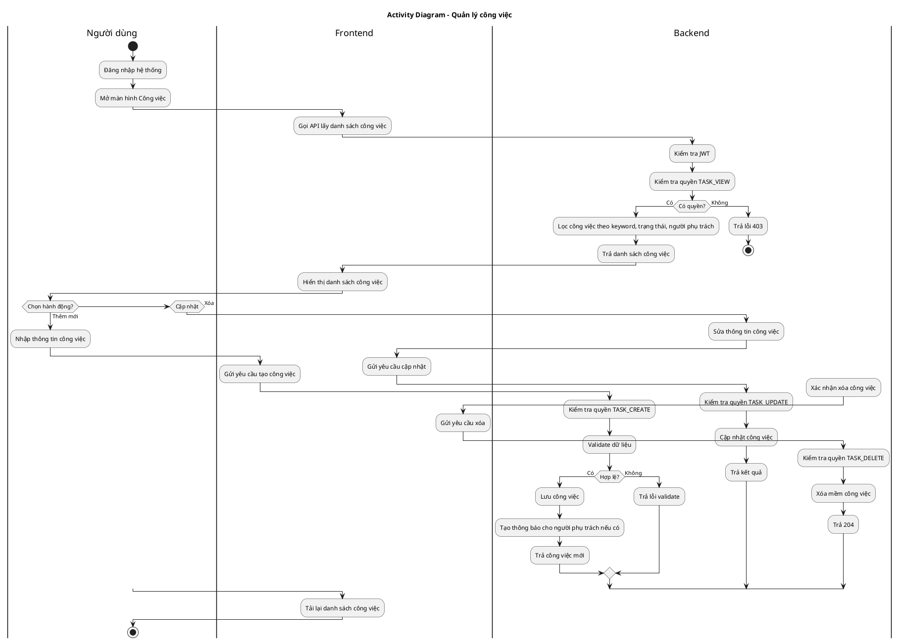
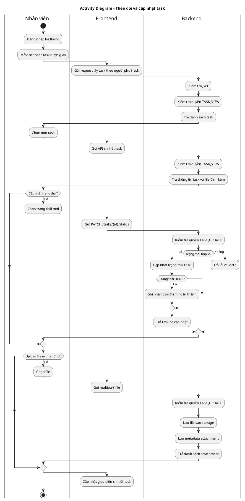
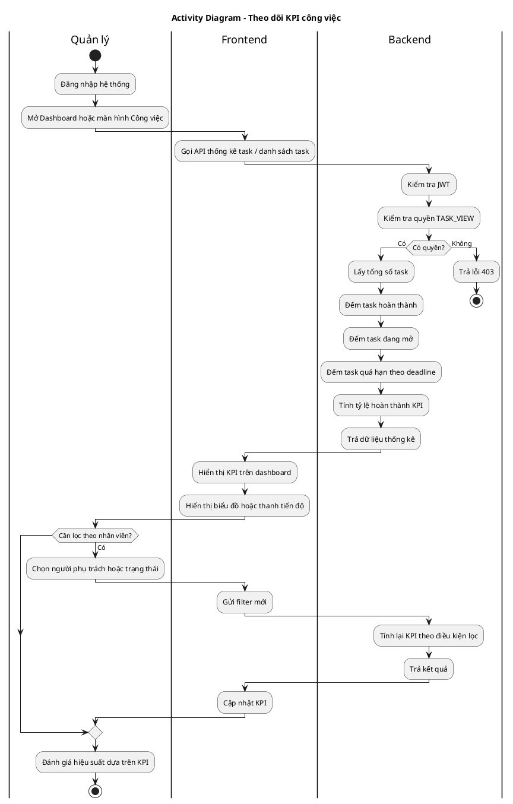
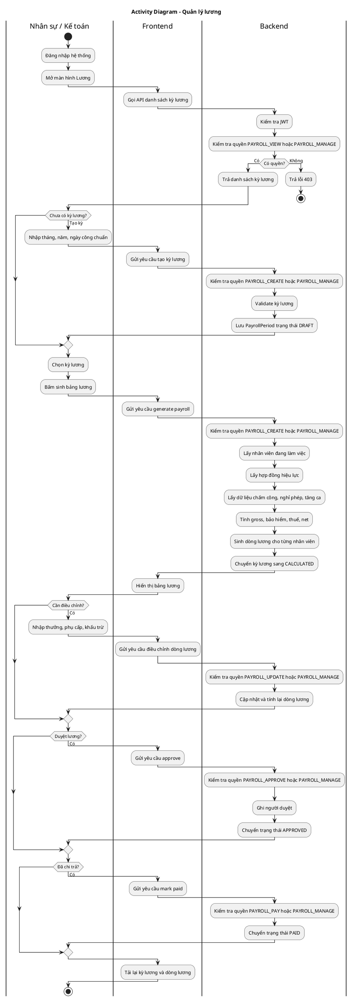
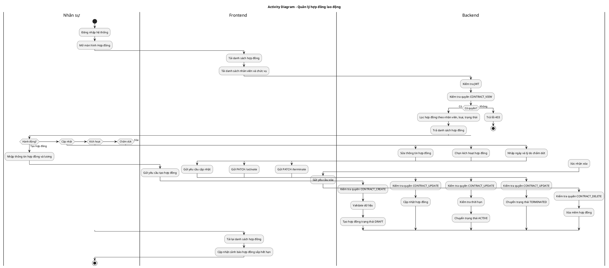
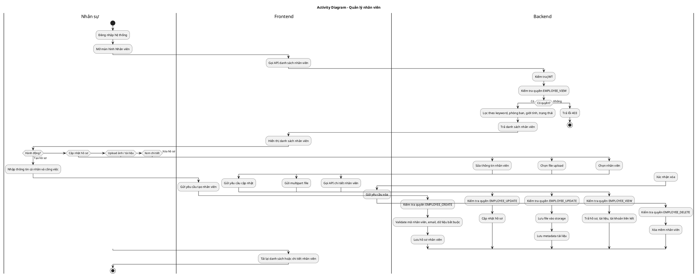
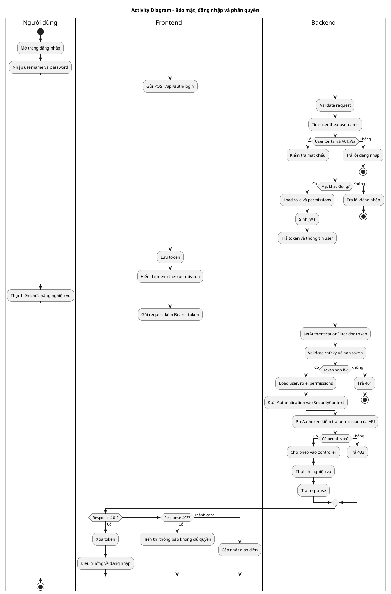

# Activity Diagram - Các case chính Vantix HRM

Mỗi case được tách thành một bảng riêng, kèm sơ đồ activity PlantUML riêng để dễ đưa vào báo cáo.

---

## Bảng 1. Công việc

| Thành phần | Nội dung |
|---|---|
| Case | Quản lý công việc |
| Actor chính | Quản lý / Nhân sự |
| Quyền liên quan | `TASK_VIEW`, `TASK_CREATE`, `TASK_UPDATE`, `TASK_DELETE` |
| Đầu vào | Thông tin công việc, người phụ trách, deadline, trạng thái |
| Đầu ra | Danh sách công việc, công việc mới/cập nhật/xóa |

---

## Bảng 2. Task

| Thành phần | Nội dung |
|---|---|
| Case | Theo dõi và cập nhật task |
| Actor chính | Nhân viên được giao task / Quản lý |
| Quyền liên quan | `TASK_VIEW`, `TASK_UPDATE` |
| Đầu vào | Task được chọn, trạng thái mới, file đính kèm |
| Đầu ra | Task đã cập nhật trạng thái, danh sách attachment |

---

## Bảng 3. KPI

| Thành phần | Nội dung |
|---|---|
| Case | Theo dõi KPI từ tiến độ task |
| Actor chính | Quản lý / Nhân sự |
| Quyền liên quan | `TASK_VIEW` |
| Đầu vào | Danh sách task, trạng thái task, deadline |
| Đầu ra | Tỷ lệ hoàn thành, task đang mở, task quá hạn, dashboard KPI |

---

## Bảng 4. Lương

| Thành phần | Nội dung |
|---|---|
| Case | Quản lý bảng lương |
| Actor chính | Nhân sự / Kế toán |
| Quyền liên quan | `PAYROLL_VIEW`, `PAYROLL_CREATE`, `PAYROLL_UPDATE`, `PAYROLL_APPROVE`, `PAYROLL_PAY`, `PAYROLL_MANAGE` |
| Đầu vào | Kỳ lương, hợp đồng, chấm công, nghỉ phép, phụ cấp, khấu trừ |
| Đầu ra | Bảng lương, phiếu lương nhân viên, trạng thái kỳ lương |

---

## Bảng 5. Hợp đồng

| Thành phần | Nội dung |
|---|---|
| Case | Quản lý hợp đồng lao động |
| Actor chính | Nhân sự |
| Quyền liên quan | `CONTRACT_VIEW`, `CONTRACT_CREATE`, `CONTRACT_UPDATE`, `CONTRACT_DELETE` |
| Đầu vào | Nhân viên, chức vụ, loại hợp đồng, ngày hiệu lực, lương, phụ cấp |
| Đầu ra | Hợp đồng nháp/hiệu lực/chấm dứt, cảnh báo sắp hết hạn |

---

## Bảng 6. Nhân viên

| Thành phần | Nội dung |
|---|---|
| Case | Quản lý hồ sơ nhân viên |
| Actor chính | Nhân sự |
| Quyền liên quan | `EMPLOYEE_VIEW`, `EMPLOYEE_CREATE`, `EMPLOYEE_UPDATE`, `EMPLOYEE_DELETE` |
| Đầu vào | Thông tin cá nhân, phòng ban, chức vụ, trạng thái làm việc, ảnh, tài liệu |
| Đầu ra | Hồ sơ nhân viên, ảnh đại diện, tài liệu nhân viên |

---

## Bảng 7. Bảo mật

| Thành phần | Nội dung |
|---|---|
| Case | Đăng nhập, JWT và phân quyền |
| Actor chính | Người dùng / Hệ thống |
| Quyền liên quan | Role và Permission của tài khoản |
| Đầu vào | Username, password, JWT token |
| Đầu ra | Token hợp lệ, thông tin người dùng, quyền truy cập hoặc lỗi 401/403 |

