# ERD - Vantix HRM

Nguon: cac JPA entity trong `Vantix/src/main/java/poly/edu/vantix/entity`.

Ghi chu:
- Moi bang entity ke thua `BaseEntity`: `id`, `created_at`, `created_by`, `updated_at`, `updated_by`, `deleted`, `deleted_at`, `deleted_by`.
- `role_permissions` la bang trung gian sinh tu quan he `Role` - `Permission`.
- Cac cot `*_by_user_id`, `head_employee_id`, `actor_user_id` trong mot so bang duoc luu dang `Long`, khong phai luc nao cung khai bao FK bang JPA.

```mermaid
erDiagram
    ROLES ||--o{ USERS : has
    ROLES ||--o{ ROLE_PERMISSIONS : grants
    PERMISSIONS ||--o{ ROLE_PERMISSIONS : included_in

    USERS ||--o| EMPLOYEES : login_account
    USERS ||--o{ AUTH_TOKENS : owns
    USERS ||--o{ PASSWORD_RESET_OTPS : requests
    USERS ||--o{ NOTIFICATIONS : receives
    USERS ||--o{ LEAVE_REQUESTS : decides
    USERS ||--o{ MAKEUP_CHECKOUT_REQUESTS : decides
    USERS ||--o{ PAYROLL_PERIODS : approves

    DEPARTMENTS ||--o{ POSITIONS : contains
    DEPARTMENTS ||--o{ EMPLOYEES : contains
    POSITIONS ||--o{ EMPLOYEES : current_position
    POSITIONS ||--o{ CONTRACTS : contract_position

    EMPLOYEES ||--o{ EMPLOYEE_DOCUMENTS : has
    EMPLOYEES ||--o{ CONTRACTS : signs
    EMPLOYEES ||--o{ WORK_SCHEDULES : scheduled
    EMPLOYEES ||--o{ ATTENDANCES : checks
    EMPLOYEES ||--o{ LEAVE_REQUESTS : requests
    EMPLOYEES ||--o{ LEAVE_REQUESTS : handover_to
    EMPLOYEES ||--o{ MAKEUP_CHECKOUT_REQUESTS : requests
    EMPLOYEES ||--o{ PAYROLLS : paid
    EMPLOYEES ||--o{ TASKS : assigned

    SHIFTS ||--o{ WORK_SCHEDULES : used_by
    WORK_LOCATIONS ||--o{ WORK_SCHEDULES : at
    WORK_SCHEDULES ||--o{ ATTENDANCES : generates
    ATTENDANCES ||--o{ MAKEUP_CHECKOUT_REQUESTS : fixed_by

    PAYROLL_PERIODS ||--o{ PAYROLLS : contains
    CONTRACTS ||--o{ PAYROLLS : basis

    TASKS ||--o{ TASK_ATTACHMENTS : has

    USERS {
        bigint id PK
        varchar username UK
        varchar email UK
        varchar password
        bigint role_id FK
        varchar status
        datetime last_login
        datetime last_active
    }

    ROLES {
        bigint id PK
        varchar name UK
        varchar description
    }

    PERMISSIONS {
        bigint id PK
        varchar name UK
        varchar description
    }

    ROLE_PERMISSIONS {
        bigint role_id PK, FK
        bigint permission_id PK, FK
    }

    EMPLOYEES {
        bigint id PK
        varchar employee_code UK
        bigint user_id FK, UK
        varchar full_name
        date date_of_birth
        varchar gender
        varchar citizen_id UK
        varchar phone_number
        varchar personal_email
        varchar photo_file_name
        text address
        bigint department_id FK
        bigint position_id FK
        date join_date
        date termination_date
        varchar employment_status
        varchar bank_account
        varchar tax_code
        varchar insurance_number
    }

    DEPARTMENTS {
        bigint id PK
        varchar code UK
        varchar name UK
        varchar description
        bigint head_employee_id
    }

    POSITIONS {
        bigint id PK
        varchar code UK
        varchar name UK
        varchar description
        bigint department_id FK
    }

    EMPLOYEE_DOCUMENTS {
        bigint id PK
        bigint employee_id FK
        varchar original_file_name
        varchar stored_file_name UK
        varchar content_type
        bigint file_size
    }

    CONTRACTS {
        bigint id PK
        varchar contract_code UK
        bigint employee_id FK
        bigint position_id FK
        varchar contract_type
        varchar status
        date signed_date
        date start_date
        date end_date
        int probation_months
        decimal base_salary
        decimal insurance_salary
        decimal responsibility_allowance
        decimal meal_allowance
        decimal transport_allowance
        decimal phone_allowance
        decimal other_allowance
        int standard_work_days
        decimal hours_per_day
        int notice_period_days
        date terminated_date
        text termination_reason
        varchar attachment_path
        text note
    }

    SHIFTS {
        bigint id PK
        varchar code UK
        varchar name
        time start_time
        time end_time
        varchar description
    }

    WORK_LOCATIONS {
        bigint id PK
        varchar name
        varchar address
        double latitude
        double longitude
        int radius_meters
    }

    WORK_SCHEDULES {
        bigint id PK
        bigint employee_id FK
        bigint shift_id FK
        bigint location_id FK
        date work_date
        varchar note
    }

    ATTENDANCES {
        bigint id PK
        bigint employee_id FK
        bigint schedule_id FK
        date work_date
        datetime check_in_at
        double check_in_lat
        double check_in_lng
        double check_in_distance
        datetime check_out_at
        double check_out_lat
        double check_out_lng
        double check_out_distance
        varchar status
        varchar note
    }

    LEAVE_REQUESTS {
        bigint id PK
        bigint employee_id FK
        varchar leave_type
        varchar status
        date start_date
        date end_date
        varchar day_unit
        text reason
        bigint handover_employee_id FK
        varchar emergency_contact
        bigint decided_by_user_id FK
        datetime decided_at
        text decision_note
    }

    MAKEUP_CHECKOUT_REQUESTS {
        bigint id PK
        bigint employee_id FK
        bigint attendance_id FK
        datetime requested_check_out_at
        text reason
        varchar status
        bigint decided_by_user_id FK
        datetime decided_at
        text decision_note
    }

    PAYROLL_PERIODS {
        bigint id PK
        int period_year
        int period_month
        date start_date
        date end_date
        int standard_work_days
        text note
        varchar status
        bigint approved_by_user_id FK
        datetime approved_at
        datetime locked_at
    }

    PAYROLLS {
        bigint id PK
        bigint period_id FK
        bigint employee_id FK
        bigint contract_id FK
        decimal base_salary
        decimal insurance_salary
        int standard_work_days
        decimal actual_work_days
        decimal paid_leave_days
        decimal unpaid_leave_days
        decimal overtime_hours_weekday
        decimal overtime_hours_weekend
        decimal overtime_hours_holiday
        decimal overtime_hours_night
        int dependents
        decimal gross_income
        decimal total_employee_insurance
        decimal personal_income_tax
        decimal net_income
        decimal total_employer_cost
        varchar status
        datetime paid_at
        text note
    }

    PAYROLL_SETTINGS {
        bigint id PK
        varchar setting_key UK
        decimal employee_social_insurance_rate
        decimal employee_health_insurance_rate
        decimal employee_unemployment_insurance_rate
        decimal employer_social_insurance_rate
        decimal employer_health_insurance_rate
        decimal employer_unemployment_insurance_rate
        decimal government_base_salary
        decimal min_regional_salary
        decimal personal_deduction
        decimal dependent_deduction
        decimal meal_allowance_exempt
        decimal overtime_weekday_multiplier
        decimal overtime_weekend_multiplier
        decimal overtime_holiday_multiplier
        decimal overtime_night_multiplier
    }

    TASKS {
        bigint id PK
        varchar title
        text description
        varchar status
        bigint assignee_employee_id FK
        date due_date
        date last_overdue_notified_at
    }

    TASK_ATTACHMENTS {
        bigint id PK
        bigint task_id FK
        varchar original_file_name
        varchar stored_file_name UK
        varchar content_type
        bigint file_size
    }

    NOTIFICATIONS {
        bigint id PK
        bigint user_id FK
        varchar type
        varchar title
        text message
        varchar title_key
        varchar message_key
        text message_params
        varchar target_url
        varchar status
        datetime read_at
    }

    AUTH_TOKENS {
        bigint id PK
        bigint user_id FK
        varchar token_type
        varchar token
        varchar status
        datetime expires_at
        datetime used_at
    }

    PASSWORD_RESET_OTPS {
        bigint id PK
        bigint user_id FK
        varchar request_id UK
        varchar otp_hash
        varchar reset_token UK
        datetime expires_at
        datetime verified_at
        datetime used_at
        int attempts
    }

    PUBLIC_HOLIDAYS {
        bigint id PK
        date holiday_date UK
        varchar name
        boolean paid_day
    }

    SYSTEM_LOGS {
        bigint id PK
        varchar level
        bigint actor_user_id
        varchar actor_username
        varchar action
        varchar module
        varchar entity_name
        bigint entity_id
        text description
        varchar ip_address
        text user_agent
    }
```

